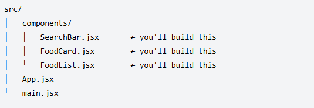
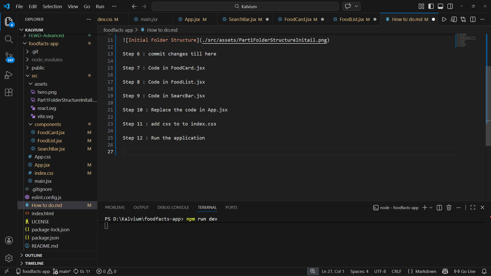

Step 1 : Clone your Git Reposetory

Step 2 : Initialize ViteReact Project

Step 3 : Push it back to github

Step 4 : Delete everything from App.css and Index.css and change App.jsx

Step 5 : Create new componets with folder structure 

Step 6 : commit changes till here

Step 7 : Code in FoodCard.jsx

Step 8 : Code in FoodList.jsx

Step 9 : Code in SearcBar.jsx

Step 10 : Replace the code in App.jsx

Step 11 : add css to to index.css 

Step 12 : Run the application

