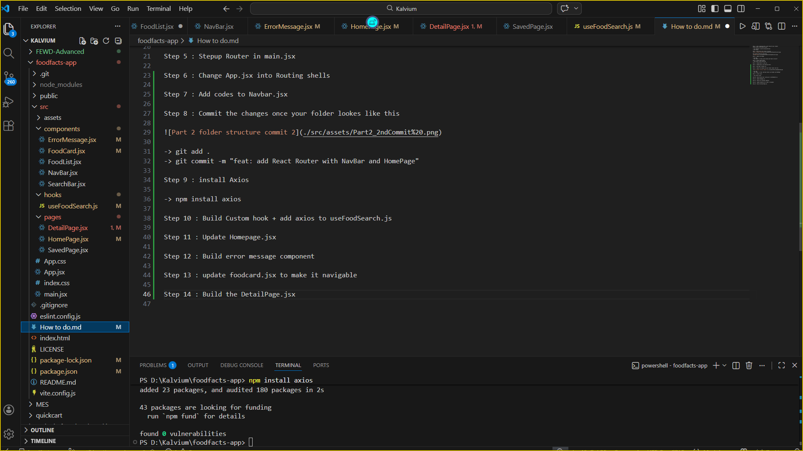

Step 1 : After completing Part 1 dont merge the pull request
insted create a new feature branch.

-> git checkout -b part2/routing-and-async
-> git branch

Step 2 : Restructure your project structure

Your project should now look like

Step 3 : Commit the changes

-> git add .
-> git commit -m "setup: part2 branch and folder structure"  

Step 4 : Install React Router
-> npm install react-router-dom

Step 5 : Stepup Router in main.jsx

Step 6 : Change App.jsx into Routing shells

Step 7 : Add codes to Navbar.jsx

Step 8 : Commit the changes once your folder lookes like this

-> git add .
-> git commit -m "feat: add React Router with NavBar and HomePage"

Step 9 : install Axios

-> npm install axios

Step 10 : Build Custom hook + add axios to useFoodSearch.js

Step 11 : Update Homepage.jsx

Step 12 : Build error message component

Step 13 : update foodcard.jsx to make it navigable

Step 14 : Build the DetailPage.jsx

Step 15 : It sould look like and commit the changes

-> git add .
-> git commit -m "feat: add DetailPage with useParams and Axios"

Step 16 Build the SavePage.jsx

Step 17 : commit the changes

-> git add .
-> git commit -m "feat: saved items with useReducer"

Step 18 : update Navebar.jsx

Step 19 : update index .css

Step 20 : update foodlist.jsx
