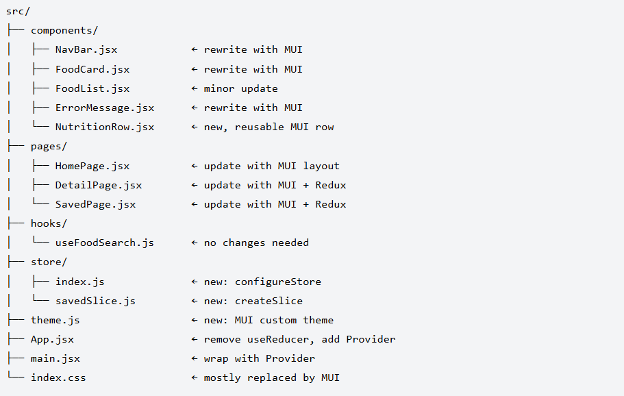
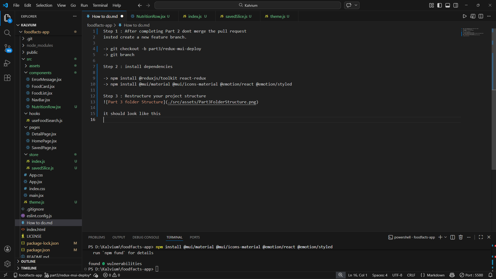
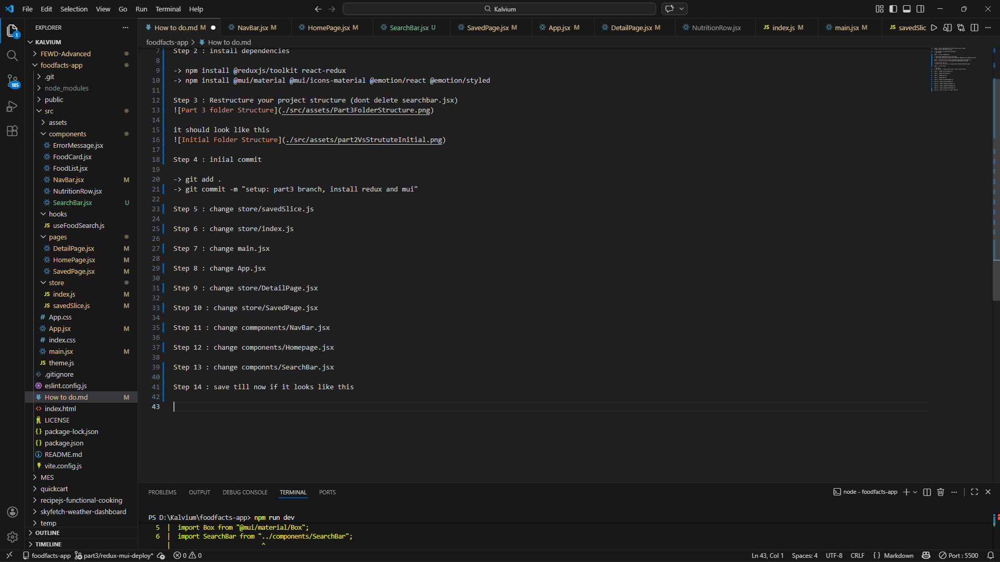
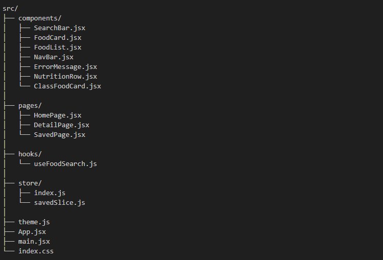

Step 1 : After completing Part 2 dont merge the pull request
insted create a new feature branch.

-> git checkout -b part3/redux-mui-deploy
-> git branch

Step 2 : install dependencies

-> npm install @reduxjs/toolkit react-redux
-> npm install @mui/material @mui/icons-material @emotion/react @emotion/styled

Step 3 : Restructure your project structure (dont delete searchbar.jsx)

it should look like this

Step 4 : iniial commit

-> git add .
-> git commit -m "setup: part3 branch, install redux and mui"

Step 5 : change store/savedSlice.js

Step 6 : change store/index.js

Step 7 : change main.jsx

Step 8 : change App.jsx

Step 9 : change store/DetailPage.jsx

Step 10 : change store/SavedPage.jsx

Step 11 : change commponents/NavBar.jsx

Step 12 : change components/Homepage.jsx

Step 13 : change componnts/SearchBar.jsx

Step 14 : save till now if it looks like this 

-> git add .
-> git commit -m "feat: replace useReducer with Redux Toolkit"

Step 15 : change src/theme.js

Step 16 : Build components/NutritionRow.jsx

Step 17 : 3rd commit

-> git add .
-> git commit -m "feat: apply Material UI throughout app"

Step 18 : create components/classFoodCart.jsx

Step 19 final commit 

-> git add .
-> git commit -m "docs: add ClassFoodCard for lifecycle reference"

Final Folder Struture

Step 20 : update index.html tytle to "FoodFacts – Search Nutrition Info"

Step 21 : build app

-> npm run build
-> npm run preview

Step 21 : update index.css

Quick Fix : Copy evvery thing from github