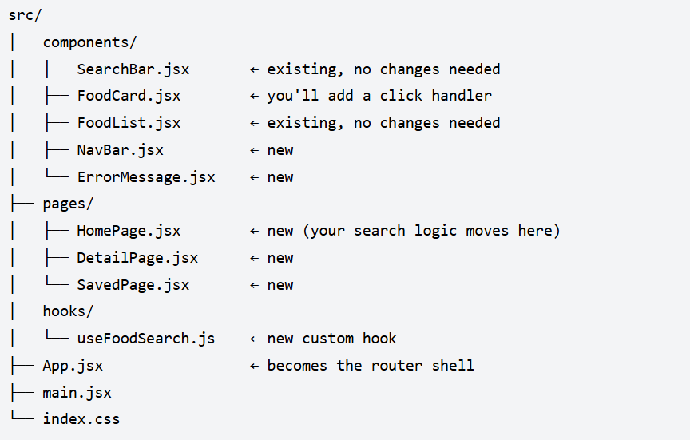
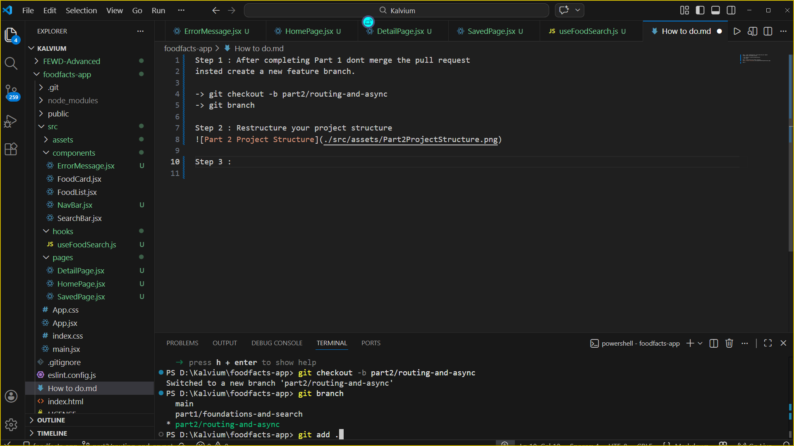

Step 1 : After completing Part 1 dont merge the pull request
insted create a new feature branch.

-> git checkout -b part2/routing-and-async
-> git branch

Step 2 : Restructure your project structure

Your project should now look like

Step 3 : Commit the changes

-> git add .
-> git commit -m "setup: part2 branch and folder structure"  

Step 4 : Install React Router
-> npm install react-router-dom

Step 5 : Stepup Router in main.jsx

